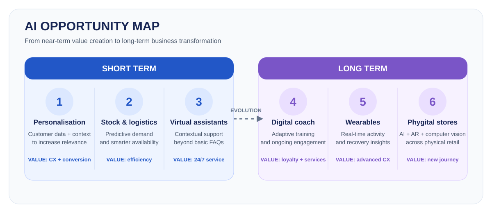
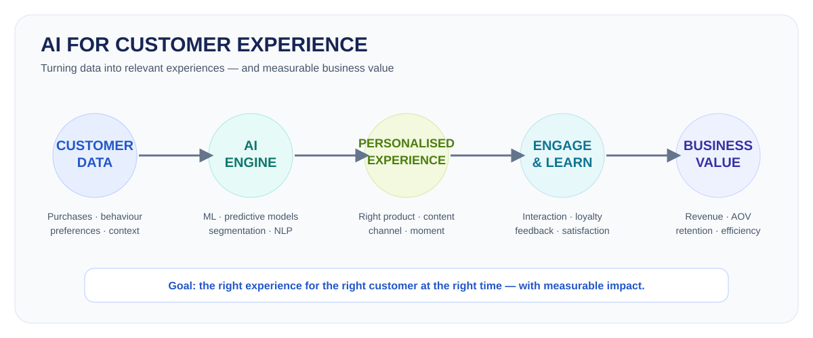
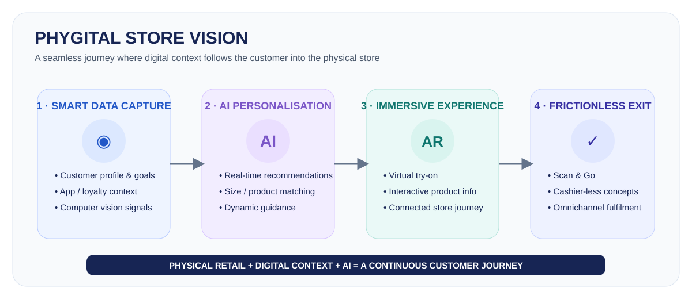

# AI Strategy & Business Transformation — Decathlon Case Study

> Academic case study on the impact of Artificial Intelligence on Decathlon, reframed as a professional portfolio project.

**Context:** Postgraduate Programme in Artificial Intelligence applied to Marketing — IPAM, June 2026  
**Original academic project:** *O impacto da IA & perspectives de transformação*  
**Co-developed by:** Lisbeth Chavez Oliveira & Luiza Callizo

> **Disclaimer:** This is an independent academic case study. It was not commissioned by, and is not affiliated with, Decathlon.

## Executive summary

Decathlon already uses AI across areas such as demand forecasting, stock management, online personalisation, product discovery and supply-chain optimisation. The strategic question explored in this project was therefore not simply *where can AI be introduced?*, but **how could AI deepen customer value in the short term and enable new service and retail models over the longer term?**

The analysis identifies six opportunity areas across two horizons:

| Horizon | Opportunity | Strategic value |
|---|---|---|
| Short term | Customer experience personalisation | More relevant recommendations and faster product discovery |
| Short term | Stock & logistics optimisation | Better planning, availability and operational efficiency |
| Short term | Intelligent virtual assistants | 24/7 contextual support and lower service workload |
| Long term | Personalised digital coach | Continuous engagement, new digital services and recurring value |
| Long term | Wearables & performance monitoring | Advanced personalisation based on real-time activity and recovery data |
| Long term | Phygital stores | Integrated physical/digital shopping through AI, computer vision and AR |

## Business context

Decathlon serves a broad spectrum of customers — from beginners and families to regular practitioners, athletes and consumers focused on health and wellbeing. This creates a central strategic challenge: **how to deliver relevance at scale across very different needs, levels of expertise and sports.**

At the same time, trends such as wellness, digital fitness, wearables and personalisation are shifting expectations from simple product retail toward more connected, continuous experiences.

## Current AI footprint considered in the analysis

The project identified existing uses of AI in areas including:

- Demand forecasting and stock optimisation
- Online personalisation and recommendations
- Intelligent product search
- Supply-chain and distribution optimisation

This current-state assessment was used as the starting point for identifying opportunities with greater impact on customer experience and future business models.

## Short-term opportunities

### 1. Personalisation of the customer experience

AI can combine purchase history, preferences, behaviour and context to make communication and product recommendations more relevant across digital and physical touchpoints.

**Illustrative scenario:** a customer in northern Portugal who regularly buys running products could receive trail-running recommendations and invitations to relevant local events instead of generic communications.

**Customer value**
- More relevant recommendations
- Faster product selection
- More personalised experience

### 2. Stock & logistics optimisation

Predictive models can combine historical demand with variables such as seasonality, weather and local events to improve forecasting and product availability.

**Business value**
- Better planning
- Greater operational efficiency
- Potential cost reduction

**Customer value**
- Better product availability
- Less waiting
- More reliable shopping experience

### 3. Intelligent virtual assistants

Generative AI and natural-language processing can move customer service beyond transactional FAQs toward contextual sports guidance.

**Illustrative scenario:** a customer planning the Camino de Santiago could ask what equipment is appropriate for the route and season, with the assistant combining context, product characteristics and available stock to make relevant suggestions.

**Business value**
- Greater service efficiency
- Reduced operational workload
- 24/7 availability

**Customer value**
- Immediate answers
- Continuous support
- Greater convenience

## Long-term transformation opportunities

### 1. Personalised digital coach

The project envisions AI evolving into a continuous digital coaching layer connected to the customer's goals, history, activity and equipment.

Potential capabilities include:
- Personalised training plans
- Weekly goals
- Recovery guidance
- Equipment recommendations

**Illustrative scenario:** a customer preparing for a first half-marathon receives a 12-week plan that adapts as training and fatigue data change.

**Potential strategic value**
- Increased loyalty
- New digital services
- Recurring revenue opportunities
- Stronger relationship beyond the point of sale

### 2. Wearables & performance monitoring

Connected devices could allow AI to analyse activity, recovery and performance data in real time to identify patterns and adapt recommendations.

The case explored potential applications such as:
- Detecting performance or recovery patterns
- Suggesting training adjustments
- Adapting recommendations
- Supporting safer, more personalised experiences

This moves the relationship from **product retailer** toward **ongoing sports and wellbeing ecosystem**.

### 3. Phygital stores

The long-term concept combines the physical store with AI-enabled digital experiences, including computer vision and augmented-reality interfaces.

The scenarios explored include:
- Smart fitting experiences
- AI-assisted product recommendations
- Virtual product visualisation
- Frictionless checkout concepts
- Personalised in-store interfaces connected to customer goals and history

The objective is a seamless journey where the customer's digital context follows them into the physical store.

## Strategic takeaway

The central insight from the project is that the most significant opportunity is not a single AI feature. It is the progression from **operational optimisation → personalised experience → continuous digital relationship → integrated sports ecosystem**.

In that model, AI becomes an enabler of:

1. **Efficiency** — forecasting, logistics and service automation  
2. **Relevance** — personalised recommendations and interactions  
3. **Engagement** — coaching, connected services and ongoing support  
4. **Business-model evolution** — digital services and phygital experiences

## Method & use of AI

ChatGPT and Gemini were used during brainstorming and structuring to map potential impact areas across product, marketing and logistics. AI-generated suggestions were **not treated as factual by default**; the academic project explicitly applied critical review, business experience and market plausibility checks before incorporating ideas.

This portfolio version preserves that distinction between:
- observed/current applications,
- strategic hypotheses,
- and future scenarios.

## What this project demonstrates

- AI opportunity mapping from a business perspective
- Translation of technology into customer and operational value
- Short- vs long-term strategic thinking
- Customer-experience design
- Retail and omnichannel transformation thinking
- Scenario development for emerging AI applications
- Critical use of generative AI in strategic work

## Detailed analysis

A more detailed breakdown of the six opportunity areas is available in [`docs/detailed-analysis.md`](docs/detailed-analysis.md).

---

### About this portfolio project

This repository is a professional reframing of an academic group project completed at IPAM. It is intended to demonstrate strategic reasoning and AI-business application rather than claim implementation of the proposed future scenarios.